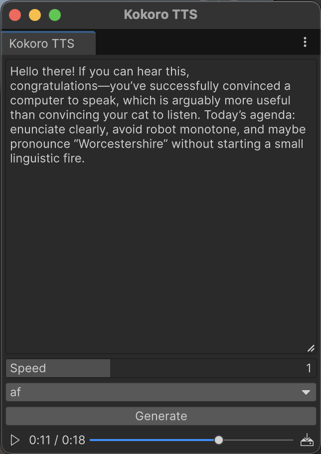

# Text-to-Speech Sample

Interactive interface powered by the Kokoro Text-To-Speech model running locally in Unity using Inference Engine.

## Runtime Inference

To power this experience we leverage the [Kokoro-82M-v1.0-ONNX](https://huggingface.co/onnx-community/Kokoro-82M-v1.0-ONNX) model, a high-quality text-to-speech model.

The system processes text inputs through:
- Text tokenization and grapheme-to-phoneme conversion using our C# implementation of Misaki for English
- Neural voice synthesis using the Kokoro ONNX model
- Real-time audio generation with multiple voice options
- Configurable speech speed and voice selection

We use this to create a seamless text-to-speech experience with natural-sounding voices.

## Features

- **Multiple Voices**: Choose from various pre-trained voice styles
- **Speed Control**: Adjustable speech rate for different use cases
- **Real-time Generation**: Fast GPU-accelerated inference using Unity's Inference Engine
- **Editor Integration**: Available as an Editor window for development and testing
- **Cross-Platform**: Support for all Unity-supported platforms thanks to pure C# implementation
- **Model Management**: Automated model downloading and setup
- **Phoneme Processing**: Automatic grapheme-to-phoneme conversion using dictionary-based lookup with comprehensive English lexicon

## Getting Started

1. Open the Unity project
2. Download models by navigating to **Inference Engine > Sample > Text-To-Speech > Download Models** in the menu
3. Navigate to **Inference Engine > Sample > Text-To-Speech > Start Kokoro** in the menu
4. Enter text and generate speech with your chosen voice!

Alternatively, you can use the runtime scene at `TextToSpeechSample/Assets/Scenes/App.unity`, but make sure to download the models beforehand using the editor menu.

The Text-To-Speech interface supports:
- Multi-line text input
- Voice selection from available models
- Real-time speech generation
- Audio playback controls

## Grapheme-to-Phoneme Conversion

This sample features a complete C# implementation of dictionary-based grapheme-to-phoneme conversion, inspired by the Misaki project. The system includes:

- **Comprehensive English Lexicon**: Uses gold and silver pronunciation dictionaries with over 130,000 word entries
- **Intelligent Text Processing**: Handles contractions, possessives, punctuation, and Unicode characters
- **Morphological Analysis**: Automatic handling of word variants with suffixes (-s, -ed, -ing)
- **Context-Aware Pronunciation**: Adjusts pronunciation based on surrounding context (e.g., "the" before vowels vs consonants)
- **No External Dependencies**: Self-contained implementation requiring no external tools or processes

The phoneme conversion system processes text through sophisticated tokenization, dictionary lookup, and fallback mechanisms to ensure accurate pronunciation for the Kokoro Text-To-Speech model.

## Technical Implementation

The sample demonstrates:
- Integration of Text-To-Speech models in Unity
- Asynchronous model inference with Kokoro
- AppUI for modern editor interfaces
- State management using Redux patterns
- Model scheduling and resource management
- Cross-platform audio generation
- Advanced text-to-phoneme processing with comprehensive English language support